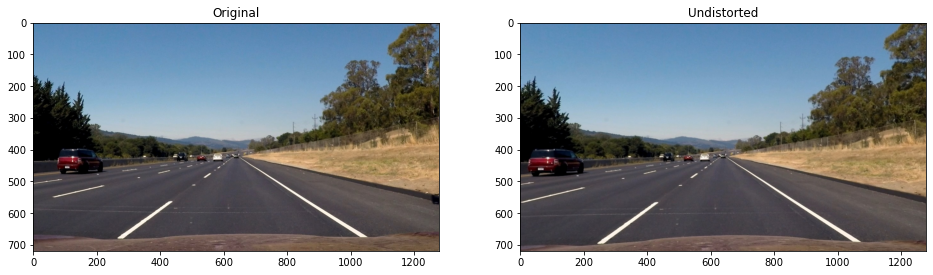
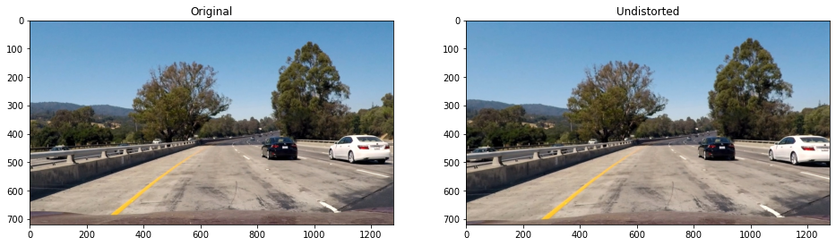
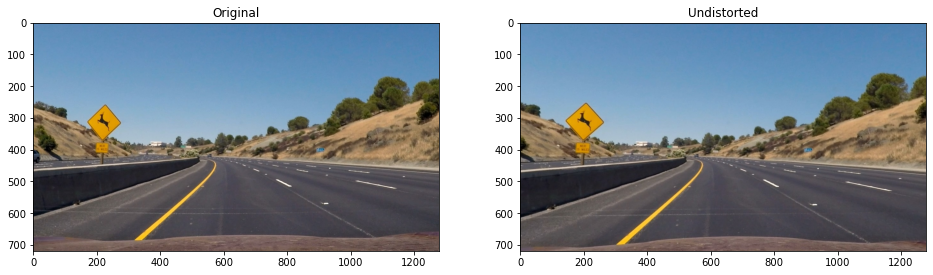
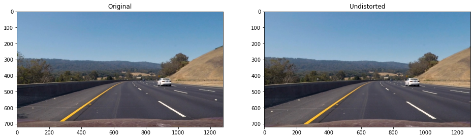
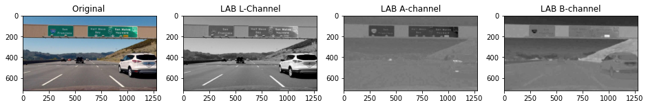

# **Project 2: CarND-Advanced-Lane-Lines** 
[](http://www.udacity.com/drive)

## Overview
In this project, the goal is to write a software pipeline to identify the lane boundaries in a video from a front-facing camera on a car.

The goals / steps of this project are the following:

* Compute the camera calibration matrix and distortion coefficients given a set of chessboard images.
* Apply a distortion correction to raw images.
* Use color transforms, gradients, etc., to create a thresholded binary image.
* Apply a perspective transform to rectify binary image ("birds-eye view").
* Detect lane pixels and fit to find the lane boundary.
* Determine the curvature of the lane and vehicle position with respect to center.
* Warp the detected lane boundaries back onto the original image.
* Output visual display of the lane boundaries and numerical estimation of lane curvature and vehicle position.

## Camera calibration

The objective of this step is to compute the camera calibration matrix `(mtx)` and  the distorsion coefficients `(dist)`. Four main functions are used:

1. `calibrate_camera(nx,ny,images)`: Calibrates the camera
2. `undistort(img, mtx, dist)`: Undistort the image
3. `read_calibration()`: Read the calibration parameters calculated and stored in the first step

### 1. Briefly state how you computed the camera matrix and distortion coefficients. Provide an example of a distortion corrected calibration image

The fucntion `calibrate_camera(nx,ny,images)` calibrates a camera using the nx,ny parameters (chessboard pattern) and a directory with images of this pattern, where `nx` is the number of corners in a row, `ny` is the number of corners in a column and `image` is the list of the images used to calculate the calibration. The function `cv2.findChessboardCorners` is used to detect the corners, the function `drawChessboardCorners` to draw the corners detected and the `calibrateCamera` to calibrate. Only images where the chessboard is detected is used to compute the calibration.


The code used to calibrate the camera:
```python
def calibrate_camera(nx,ny,images):
    """
    Calibrate a camera using the nx,ny parameters (chessboard pattern) and a directory with images of this pattern
    nx: number of corners in a row
    ny: number of corners in a column
    image: list of the images used to calculate the calibration
    """
    # Prepare object points [(0,0,0), (1,0,0), ....,(6,5,0)] using the nx and ny parameters (chessboard)
    objp = np.zeros((nx*ny,3), np.float32)
    objp[:,:2] = np.mgrid[0:nx, 0:ny].T.reshape(-1,2)
    # Arrays to store object points and image points from all the images.
    objpoints = [] # 3d points in real world space (once there're defined, they are always the same points)
    imgpoints = [] # 2d points in image plane (for each image used to calibrate).

    for fname in images:
        img = cv2.imread(fname)
        gray = cv2.cvtColor(img, cv2.COLOR_BGR2GRAY) # Convert to gray
        ret, corners = cv2.findChessboardCorners(gray, (nx, ny), None)
        # If found, add object points, image points
        if ret == True:
            objpoints.append(objp)
            imgpoints.append(corners)
    if (len(objpoints) > 0):
        ret, mtx, dist, rvecs, tvecs = cv2.calibrateCamera(objpoints, imgpoints, gray.shape[::-1], None, None)
    return mtx, dist
```

An example image (one chessboard) is undistorted using the function `undistort(img, mtx, dist)` that undistort the image `img` using the calibrarion matrix `mtx` and the distorsion parameters `dist`. Return the undirstoted image `dst`.

 

## Pipeline (test images)

### 1. Provide an example of a distortion-corrected image.

In this step I apply distortion correction to the images placed on the folder `test_images` using the next code.

```python
# ----------------------------------------------------------------------------------------------------
# Undistort all the test_images folder
# ----------------------------------------------------------------------------------------------------

# Read calibration matrix (mtx) and distortion coefficients
mtx, dist = read_calibration("calibration.p")
# Read test_images folder
images = [cv2.imread(fname) for fname in glob.glob("test_images/*")]

# All the images from the test_image folder are undirstorted but only one displayed as an example
undistorted_images = list(map(lambda img: undistort_image_visualization(img,mtx,dist), images))
```
The result are the following undirstorted images.








### 2. Describe how (and identify where in your code) you used color transforms, gradients or other methods to create a thresholded binary image. Provide an example of a binary image result.

On this step I created a pipeline to obtain a thresholded binary image combining the result from color transforms (`RGB`, `HLS` and `LAB` color spaces) and gradients (directional gradient, magnitude and direction). 

The functions that create a binary image using the gradient are listed below with the result applied to the same image. Latter we will see how all this functions are combined in one in order to speed up the final pipeline:

* `abs_sobel_thresh(gray, orient = 'x', grad_kernel = 3, grad_thresh = (0, 255)`: Creates a binary image using applying the sobel absolute operator in one axes (`x` or `y`)


* `mag_threshold(gray, mag_kernel = 3, mag_thresh = (0, 255))`: Creates a binary image using applying the gradient magnitude


* `dir_threshold(gray, dir_kernel = 3, dir_thresh = (0, np.pi/2))`: Creates a binary image using applying the gradient direction


Also a color threshold is used to detect the lines. As we have lines with different colors, we have shadows on the road and other challenges situations, I've applied the thresholds over different color spaces to make the final pipeline more robust.

* `R` channel of the `RGB` color space 
* `S` channel of the `HLS` color space
* `L` channel of the `HLS` color space
* `B` channel of the `LAB` color space

The next figure display each channel of the color spaces used.




To apply the threshold of each channel I created this functions:
* `color_hls_threshold(img, h_thresh=(255,0),l_thresh=(255,0),s_thresh=(255,0))`: Applies a color threshold on the HLS channels. With the default threshold parameters channels are "disabled"


* `color_rgb_threshold(img, r_thresh=(255,0),g_thresh=(255,0),b_thresh=(255,0))`: Applies a color threshold on the RGB channels. With the default threshold parameters channels are "disabled"


* `color_lab_threshold(img, l_thresh=(255,0), a_thresh=(255,0), b_thresh=(255,0))`: Applies a color threshold on the LAB channels. With the default threshold parameters channels are "disabled". This options works very well with yellow lines (not this example)


The `combined_threshold` function wraps all of the above functions/steps and return a binary thresholded image `color_binary`. (with default parameters used) 


```python
def combined_color_threshod(img, r_thresh=(225,255), l_thresh=(215,255), s_thresh=(170,255), b_thresh=(180,255)):
    """
    Apply a color threshold to:
        R - Channel (RGB space color)
        L - Channel (HLS space color)
        S - Channel (HLS space color)
        B - Channel (LAB space color)        
    
    Parameters:
        img (numpy.ndarray): Color image
        r_thresh (list): Minimum ([0]) and maximun ([1]) threshold values for the R channel (RGB)
        l_thresh (list): Minimum ([0]) and maximun ([1]) threshold values for the L channel (HLS)
        s_thresh (list): Minimum ([0]) and maximun ([1]) threshold values for the S channel (HLS)
        b_thresh (list): Minimum ([0]) and maximun ([1]) threshold values for the S channel (LAB)
        
    Returns:
        color_binary (numpy.ndarray): combined binary image
    """
    _, l, s = hls(img)
    r, _, _ = rgb(img)
    _, _, b = lab(img)
    
    color_binary = np.zeros_like(r)
    color_binary[((r > r_thresh[0]) & (r <= r_thresh[1])) |
                 ((l > l_thresh[0]) & (l <= l_thresh[1])) | 
                 ((s > s_thresh[0]) & (s <= s_thresh[1])) |
                 ((b > b_thresh[0]) & (b <= b_thresh[1])) ] = 1
    
    return color_binary    
```

Finally, the function `combined_grad_color_threshold` wrap all the color and gradient threshold functions that will be used on the final **pipeline**.


```python
def combined_grad_color_threshold(img, r_thresh=(225,255),l_thresh=(215,255),s_thresh=(170,255),
                                  grad_kernel = 3, gradx_thresh = (20,100), grady_thresh = (50,100),
                                  mag_kernel = 5, mag_thresh = (50,100),
                                  dir_kernel = 9, dir_thresh = (0.7,1.3)):
    """
    Apply gradient and color threshold combined:
        1. Apply combined_color_threshod (R - Channel (RGB),L - Channel (HLS), S - Channel (HLS)
        2. Gradient, magnitud and direction threshold using th sobel opertor
    Parameters:
        img (numpy.ndarray): Color image
        r_thresh (list): Minimum ([0]) and maximun ([1]) threshold values for the R channel (RGB)
        l_thresh (list): Minimum ([0]) and maximun ([1]) threshold values for the L channel (HLS)
        grad_kernel (int): Gradient kernel size (same for X and Y)
        gradx_thresh (list): Minimum ([0]) and maximun ([1]) threshold values for X gradiente
        grady_thresh (list): Minimum ([0]) and maximun ([1]) threshold values for Y gradiente
        mag_kernel (int): Magnitude kernel size
        mag_thresh (list): Minimum ([0]) and maximun ([1]) threshold values for magnitude
        dir_kernel (int): Direction kernel size
        dir_thresh (list): Minimum ([0]) and maximun ([1]) threshold values for direction
        
    Returns:
        combined_binary (numpy.ndarray): combined binary image
    """   
    color_binary = combined_color_threshod(img)
    
    gray = cv2.cvtColor(img,cv2.COLOR_RGB2GRAY)
    # Apply Sobel opertor to X and Y
    gradx = abs_sobel_thresh(gray, 'x', grad_kernel, gradx_thresh)
    grady = abs_sobel_thresh(gray, 'y', grad_kernel, grady_thresh)
    # Magnitude
    mag_binary = mag_threshold(gray, mag_kernel, mag_thresh)
    # Direction
    dir_binary = dir_threshold(gray, dir_kernel, dir_thresh)
    # Combined
    combined_binary = np.zeros_like(color_binary)
    combined_binary[((gradx == 1) & (grady == 1)) | ((mag_binary == 1) & (dir_binary == 1)) | (color_binary == 1)] = 1
    
    return combined_binary
```

### 3. Describe how (and identify where in your code) you performed a perspective transform and provide an example of a transformed image.

To make the perspective tranformation ("bied eye view") we assume that the road is a flat plane (not strictly true). Then we have to calculate the matrix `M` and the inverse. This matrix is calculated by the function `calculate_M_Minv_matrix` that returns the matrix `M` and and `Minv`. The variable `src` define the region of intered (equivalent to the mask on the previous project) and have been adjusted manually using one of the test pictures with straight lane lines for example the `test_images/straight_lines1.jpg`. The destination points area also calculate.  The destionation points could be calculated automatically (see [this blog](https://www.pyimagesearch.com/2014/08/25/4-point-opencv-getperspective-transform-example/) for more details).

```python
# Source points (to be incorporated as parameters to the final solution)
src1 = (585, 460)#(575, 465)
src2 = (695, 460)#(705, 465)
src3 = (1127, 720)#(1050, 685)
src4 = (203, 720)#(255, 685)
src = np.float32([src1, src2, src3, src4])

# Destination points (to be incorporated as parameters to the final solution)
dst1 = (320, 0)
dst2 = (width - 320, 0)
dst3 = (width - 320, height)
dst4 = (320, height)
dst = np.float32([dst1, dst2, dst3, dst4])

M, Minv = calculate_M_Minv_matrix(src, dst)
``` 

Once we have the matrix I apply the transformation with the function `warp_image` and to check the sanity of the transformation I draw a rectangule.


### 4. Describe how (and identify where in your code) you identified lane-line pixels and fit their positions with a polynomia

I've implemented two methods to identify the lane lines. The first one is the sliding window approach. This method is used when the system start from blind point or from scratch. An image histogram is used to detec the peaks from the left and right parts of the binary image (that cames from the previous steps of the pipeline: undistorted, binarized and transformed). On the next figure you can see an example. 


Once the two peaks have been detected the sliding windows method apply a window over an specific area and detects the points that are activated. Those point `(x,y)` are stored and are use to re-center (if needed) the next window. All the `y` axes is cover (from botton to top) in order to detect all pixels. After all the process we have a list of pixels that can be used to fit a polinomio that correspond with the lines (left and rigth). On the next figure you can see an example


As I told, this method is used only at the beginning or if the tracking systema lost the lane lines. Normally, if the lines are detected, the previous fiting is used to find the lines. A parameter or a margin is applied over the previous fit, to detect the pixels that are candidate to be lines. Once we have the pixels we can calculate the new polinomio. 


### 5. Describe how (and identify where in your code) you calculated the radius of curvature of the lane and the position of the vehicle with respect to center.

We assume the camera is mounted at the center of the car and the deviation of the midpoint of the lane from the center of the image is the offset you're looking for. In the last step we located the lane line pixels and used their x and y pixel positions to fit a second order polynomial curve `f(y) = Ay^2 + By + C`. The radius of curvature [awesome tutorial here](https://www.intmath.com/applications-differentiation/8-radius-curvature.php) at any point xx of the function x = f(y)x=f(y) is given as follows:


As we assumed that the camera is mounted at the center of the car, such that the lane center is the midpoint at the bottom of the image between the two lines detected. The offset of the lane center from the center of the image (converted from pixels to meters) is the distance from the center of the lane.

This two functions are implemented in the `Line` class, methods `__calculate_radius_of_curvature` and `__calculate_line_base_pos`. 

```python
    def __calculate_radius_of_curvature(self):
        # Define conversions in x and y from pixels space to meters
        ym_per_pix = 30/720 # meters per pixel in y dimension
        xm_per_pix = 3.7/640 # meters per pixel in x dimension
        
        fit_crv = [self.__best_fit[0]*(xm_per_pix/(ym_per_pix**2)),self.__best_fit[1]*(xm_per_pix/ym_per_pix),self.__best_fit[2]]

        y_eval = np.max(self.__evaly)
        self.__radius_of_curvature = ((1 + (2 * fit_crv[0] * y_eval + 
                          fit_crv[1])**2)**1.5) / np.absolute(2 * fit_crv[0])
```

```python
 car_position = new_img.shape[1]/2
 lane_center_position = l_line_x + (r_line_x - l_line_x)/2
 xm_per_pix = 3.7/640 # meters per pixel in x dimension

 center_dist = (car_position - lane_center_position) * xm_per_pix
```

Once the lines are detected, curvature calculated and car position we can perform a transformation to display the lines detected over the images.


# Pipeline (video)

Finally I appliy the pipeline to a video. First we create a function call `process_image` that processs each frame and make some sanity calculations:
```python
def process_image(img):

    wraped = pipeline(img, mtx, dist, M)
    
    if (left_line.detected and right_line.detected): # If left and right lines are detected
        leftx, lefty, rightx, righty = search_around_poly(wraped, left_line.best_fit, right_line.best_fit, sap_margin = 70)
        
    else:   
        leftx, lefty, rightx, righty, _, _, _ = find_lane_pixels(wraped, nwindows = 9, margin = 70, minpix = 50)
      
    left_line.xy_pixels = (leftx, lefty)
    right_line.xy_pixels = (rightx, righty)
    
    if left_line.best_fit is not None and right_line.best_fit is not None:
        img_lane = draw_lane_line(img, Minv, left_line.bestfitx, right_line.bestfitx, left_line.ploty)
        img_param = draw_info(img_lane, left_line.radius_of_curvature, right_line.radius_of_curvature,
                             left_line.line_base_pos, right_line.line_base_pos)

    return img_param
```

Videos:
* [Project video](https://youtu.be/pCkfgdmMZb4)

## Discussion

Improvements to make more robust the algorithm:

* Other methods like neuronal networks could be applied to find the lines, specially at the begining of the process.
* When appling the sliding window procedure, the histogram could be applied for specific areas where is supossed to be the lines
* Other color spaces or new tunned parameters (for the challenge video)

# Licence
[MIT](https://choosealicense.com/licenses/mit/)

# Contribute
Pull requests are welcome. For major changes, please open an issue first to discuss.

# About me
My name is [Javier Huarte](https://github.com/jhuarte) @jhuarte. I'm a Computer Science Engineer by EUPLA & UOC Univerties. Robotics, coding, cycling and motorsport apossionated. Actually R&D Engineer at [ITAINNOVA](www.itainnova.es).
